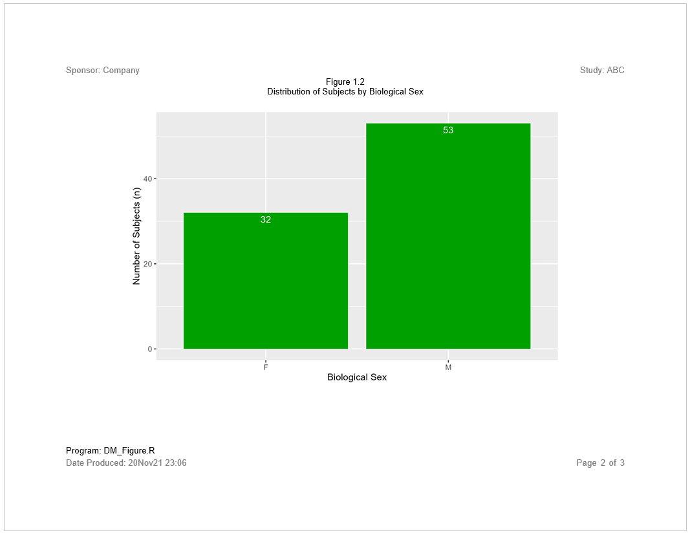

```{r setup, include = FALSE}
knitr::opts_chunk$set(
  collapse = TRUE,
  comment = "#>"
)

options(rmarkdown.html_vignette.check_title = FALSE)

```
## Program

The previous examples in the **libr** documentation were intentionally
simplified to focus on the workings of a particular function.  It is helpful,
however, to also view **libr** functions in the context of a complete 
program.  The following example shows a complete program.  The example illustrates
how **libr** functions work together, and interact with **tidyverse** and
**sassy** functions to create a report.  

The data for this example has been included in the **libr** package as an
external data file.  It may be accessed using the `system.file()` function
as shown below, or downloaded directly from the **libr** GitHub site 
[here](https://raw.githubusercontent.com/dbosak01/libr/master/inst/extdata/DM.csv)

```{r eval=FALSE, echo=TRUE}
library(tidyverse)
library(sassy)


# Prepare Log -------------------------------------------------------------


options("logr.autolog" = TRUE,
        "logr.notes" = FALSE)

# Get temp location for log and report output
tmp <- tempdir()

# Open log
lf <- log_open(file.path(tmp, "example1.log"))


# Load and Prepare Data ---------------------------------------------------

sep("Prepare Data")

# Get path to sample data
pkg <- system.file("extdata", package = "libr")

# Define data library
libname(sdtm, pkg, "csv", quiet = TRUE) 

# Prepare data
dm_mod <- sdtm$DM %>% 
  select(USUBJID, SEX, AGE, ARM) %>% 
  filter(ARM != "SCREEN FAILURE") %>% 
  datastep({
    
    if (AGE >= 18 & AGE <= 24)
      AGECAT = "18 to 24"
    else if (AGE >= 25 & AGE <= 44)
      AGECAT = "25 to 44"
    else if (AGE >= 45 & AGE <= 64)
      AGECAT <- "45 to 64"
    else if (AGE >= 65)
      AGECAT <- ">= 65"
    
  }) %>% put()

put("Get population counts")
arm_pop <- count(dm_mod, ARM) %>% put()
sex_pop <- count(dm_mod, SEX) %>% put()
agecat_pop <- count(dm_mod, AGECAT) %>% put()

# Convert agecat to factor so rows will sort correctly
agecat_pop$AGECAT <- factor(agecat_pop$AGECAT, levels = c("18 to 24", 
                                                          "25 to 44",
                                                          "45 to 64",
                                                          ">= 65"))
# Sort agecat
agecat_pop <- agecat_pop %>% arrange(AGECAT)


# Create Plots ------------------------------------------------------------


plt1 <- ggplot(data = arm_pop, aes(x = ARM, y = n)) +
  geom_col(fill = "#0000A0") +
  geom_text(aes(label = n), vjust = 1.5, colour = "white") +
  labs(x = "Treatment Group", y = "Number of Subjects (n)")

plt2 <- ggplot(data = sex_pop, aes(x = SEX, y = n)) +
  geom_col(fill = "#00A000") +
  geom_text(aes(label = n), vjust = 1.5, colour = "white") +
  labs(x = "Biological Sex", y = "Number of Subjects (n)")

plt3 <- ggplot(data = agecat_pop, aes(x = AGECAT, y = n)) +
  geom_col(fill = "#A00000") +
  geom_text(aes(label = n), vjust = 1.5, colour = "white") +
  labs(x = "Age Categories", y = "Number of Subjects (n)")


# Report ------------------------------------------------------------------


sep("Create and print report")


page1 <- create_plot(plt1, 4.5, 7) %>% 
  titles("Figure 1.1", "Distribution of Subjects by Treatment Group")

page2 <- create_plot(plt2, 4.5, 7) %>% 
  titles("Figure 1.2", "Distribution of Subjects by Biological Sex")

page3 <- create_plot(plt3, 4.5, 7) %>% 
  titles("Figure 1.2", "Distribution of Subjects by Age Category")

rpt <- create_report(file.path(tmp, "./output/example1.rtf"), output_type = "RTF", 
                     font = "Arial") %>% 
  set_margins(top = 1, bottom = 1) %>% 
  page_header("Sponsor: Company", "Study: ABC") %>% 
  add_content(page1) %>% 
  add_content(page2) %>% 
  add_content(page3) %>% 
  footnotes("Program: DM_Figure.R") %>% 
  page_footer(paste0("Date Produced: ", fapply(Sys.time(), "%d%b%y %H:%M")), 
              right = "Page [pg] of [tpg]")

res <- write_report(rpt)


# Clean Up ----------------------------------------------------------------
sep("Clean Up")

# Close log
log_close()

# View log
# file.show(lf)

# View report
# file.show(res$file_path)

```

## Log

Here is the log from the above program:
```
=========================================================================
Log Path: C:/Users/dbosa/AppData/Local/Temp/RtmpwLpEIV/log/example1.log
Program Path: C:\packages\Testing\libr_example1.R
Working Directory: C:/packages/Testing
User Name: dbosa
R Version: 4.1.2 (2021-11-01)
Machine: SOCRATES x86-64
Operating System: Windows 10 x64 build 19041
Base Packages: stats graphics grDevices utils datasets methods base
Other Packages: tidylog_1.0.2 reporter_1.2.6 libr_1.2.1 fmtr_1.5.4 logr_1.2.7
                sassy_1.0.5 forcats_0.5.1 stringr_1.4.0 dplyr_1.0.7 purrr_0.3.4
                readr_2.0.2 tidyr_1.1.4 tibble_3.1.5 ggplot2_3.3.5 tidyverse_1.3.1
Log Start Time: 2021-11-20 23:06:50
=========================================================================

=========================================================================
Prepare Data
=========================================================================

# library 'sdtm': 8 items
- attributes: csv not loaded
- path: C:/Users/dbosa/Documents/R/win-library/4.1/libr/extdata
- items:
  Name Extension Rows Cols     Size        LastModified
1   AE       csv  150   27  88.3 Kb 2021-10-08 15:02:15
2   DA       csv 3587   18 528.1 Kb 2021-10-08 15:02:15
3   DM       csv   87   24  45.4 Kb 2021-10-08 15:02:15
4   DS       csv  174    9  33.9 Kb 2021-10-08 15:02:15
5   EX       csv   84   11  26.2 Kb 2021-10-08 15:02:15
6   IE       csv    2   14  13.2 Kb 2021-10-08 15:02:15
7   SV       csv  685   10  70.2 Kb 2021-10-08 15:02:15
8   VS       csv 3358   17 467.3 Kb 2021-10-08 15:02:15

lib_load: library 'sdtm' loaded

select: dropped 20 variables (STUDYID, DOMAIN, SUBJID, RFSTDTC, RFENDTC, <U+0085>)

filter: removed 2 rows (2%), 85 rows remaining

datastep: columns increased from 4 to 5

# A tibble: 85 x 5
   USUBJID    SEX     AGE ARM   AGECAT  
   <chr>      <chr> <dbl> <chr> <chr>   
 1 ABC-01-049 M        39 ARM D 25 to 44
 2 ABC-01-050 M        47 ARM B 45 to 64
 3 ABC-01-051 M        34 ARM A 25 to 44
 4 ABC-01-052 F        45 ARM C 45 to 64
 5 ABC-01-053 F        26 ARM B 25 to 44
 6 ABC-01-054 M        44 ARM D 25 to 44
 7 ABC-01-055 F        47 ARM C 45 to 64
 8 ABC-01-056 M        31 ARM A 25 to 44
 9 ABC-01-113 M        74 ARM D >= 65   
10 ABC-01-114 F        72 ARM B >= 65   
# ... with 75 more rows

Get population counts

count: now 4 rows and 2 columns, ungrouped

# A tibble: 4 x 2
  ARM       n
  <chr> <int>
1 ARM A    20
2 ARM B    21
3 ARM C    21
4 ARM D    23

count: now 2 rows and 2 columns, ungrouped

# A tibble: 2 x 2
  SEX       n
  <chr> <int>
1 F        32
2 M        53

count: now 4 rows and 2 columns, ungrouped

# A tibble: 4 x 2
  AGECAT       n
  <chr>    <int>
1 >= 65       13
2 18 to 24     5
3 25 to 44    23
4 45 to 64    44

=========================================================================
Create and print report
=========================================================================

# A report specification: 3 pages
- file_path: 'C:\Users\dbosa\AppData\Local\Temp\RtmpwLpEIV/./output/example1.rtf'
- output_type: RTF
- units: inches
- orientation: landscape
- margins: top 1 bottom 1 left 1 right 1
- line size/count: 9/40
- page_header: left=Sponsor: Company right=Study: ABC
- footnote 1: 'Program: DM_Figure.R'
- page_footer: left=Date Produced: 20Nov21 23:06 center= right=Page [pg] of [tpg]
- content: 
# A plot specification: 
- data: 4 rows, 2 cols
- layers: 2
- height: 4.5
- width: 7
- title 1: 'Figure 1.1'
- title 2: 'Distribution of Subjects by Treatment Group'
# A plot specification: 
- data: 2 rows, 2 cols
- layers: 2
- height: 4.5
- width: 7
- title 1: 'Figure 1.2'
- title 2: 'Distribution of Subjects by Biological Sex'
# A plot specification: 
- data: 4 rows, 2 cols
- layers: 2
- height: 4.5
- width: 7
- title 1: 'Figure 1.2'
- title 2: 'Distribution of Subjects by Age Category'

=========================================================================
Clean Up
=========================================================================

lib_sync: synchronized data in library 'sdtm'

lib_unload: library 'sdtm' unloaded

=========================================================================
Log End Time: 2021-11-20 23:06:57
Log Elapsed Time: 0 00:00:07
=========================================================================
```

## Output

And here is the output:





Next: [Complete Example 2](libr-example2.html)

