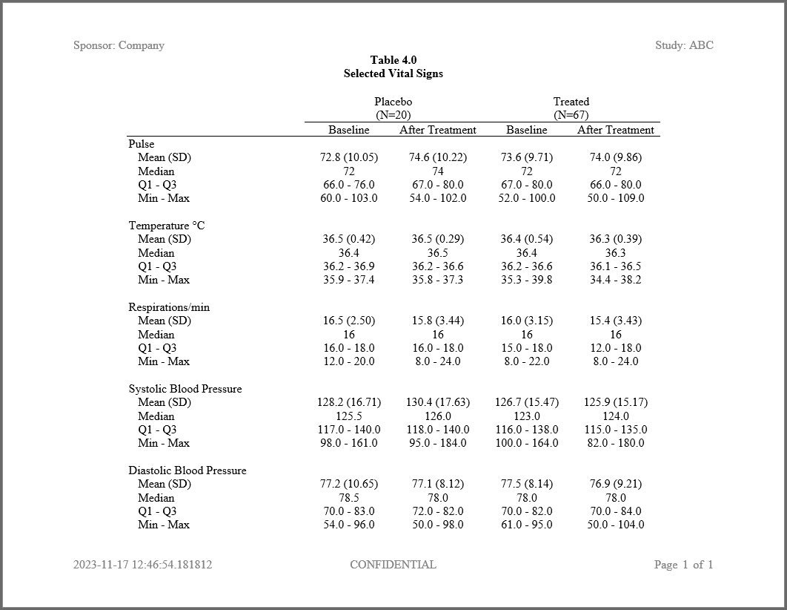

```{r setup, include = FALSE}
knitr::opts_chunk$set(
  collapse = TRUE,
  comment = "#>"
)

options(rmarkdown.html_vignette.check_title = FALSE)

```
## Program

Here is another example of a complete program that demonstrates several of the
key functions in the **libr** package.  The example also shows how the package 
integrates with **sassy**.

```{r eval=FALSE, echo=TRUE}
library(sassy)

options("logr.autolog" = TRUE,
        "logr.notes" = FALSE)

# Get temp location for log and report output
tmp <- tempdir()

# Open log
lf <- log_open(file.path(tmp, "example1.log"))


# Prepare Data ------------------------------------------------------------

sep("Prepare Data")

# Get path to sample data
pkg <- system.file("extdata", package = "libr")

# Create libname for csv data
libname(sdtm, pkg, "csv", quiet = TRUE) 


put("Join and prepare data")

put("Join DM to VS and keep desired columns")
datastep(sdtm$DM, merge = sdtm$VS, merge_by = USUBJID,
         keep = v(USUBJID, VSTESTCD, VISIT, VISITNUM, VSSTRESN, ARM, VSBLFL), 
         where = expression(VSTESTCD %in% c("PULSE", "RESP", "TEMP", "DIABP", "SYSBP") & 
                            !(VISIT == "SCREENING" & VSBLFL != "Y")), {}) -> dm_joined

put("Sort by variables")
proc_sort(dm_joined, by = v(USUBJID, VSTESTCD, VISITNUM)) -> dm_sorted

put("Differentiate baseline from treated vital signs")
datastep(dm_sorted, by = v(USUBJID, VSTESTCD),
         retain = list(BSTRESN = 0), {
  
  # Combine treatment groups
  # And distinguish baseline time points
  if (ARM == "ARM A") {
    if (VSBLFL %eq% "Y") {
      GRP <- "A_BASE"
    } else {
      GRP <- "A_TRT"
    }
  } else {
    if (VSBLFL %eq% "Y") {
      GRP <- "O_BASE"
    } else {
      GRP <- "O_TRT"
    }
  }
  
  # Populate baseline value
  if (first.)
    BSTRESN = VSSTRESN
  
}) -> prep
         

put("Get population counts")
pop_A <- subset(prep, GRP == "A_BASE", v(USUBJID, GRP)) |> 
  proc_sort(options = nodupkey) |> 
  proc_freq(tables = GRP, 
            options = v(nocum, nonobs, nopercent), 
            output = long) |> 
  subset(select = "A_BASE", drop = TRUE)

pop_O <- subset(prep, GRP == "O_BASE", v(USUBJID, GRP)) |> 
  proc_sort(options = nodupkey) |> 
  proc_freq(tables = GRP, 
            options = v(nocum, nonobs, nopercent), 
            output = long) |> 
  subset(select = "O_BASE", drop = TRUE)


# Prepare formats ---------------------------------------------------------

sep("Prepare formats")


put("Vital sign lookup format")
vs_fmt <- c(PULSE = "Pulse", 
            TEMP = "Temperature °C", 
            RESP = "Respirations/min", 
            SYSBP = "Systolic Blood Pressure", 
            DIABP = "Diastolic Blood Pressure") |> put()

put("Statistics lookup format")                
stat_fmt <- c(MEANSTD = "Mean (SD)",
              MEDIAN = "Median",
              Q1Q3 = "Q1 - Q3",
              MINMAX = "Min - Max") |> put()


put("Create format catalog")
fc <- fcat(MEAN = "%.1f", 
           STD = "(%.2f)", 
           MEDIAN = "%.1f",
           Q1 = "%.1f",
           Q3 = "%.1f",
           MIN = "%.1f", 
           MAX = "%.1f")

# Prepare final data frame ------------------------------------------------

sep("Prepare final data")

put("Calculate statistics and prepare final data frame")
proc_means(prep, var = VSSTRESN, class = VSTESTCD, by = GRP,
           stats = v(mean, std, median, q1, q3, min, max),
           options = v(notype, nofreq, nway)) |> 
  datastep(format = fc, 
           drop = v(MEAN, STD, Q1, Q3, MIN, MAX, VAR),
           rename = c("CLASS" = "VAR"),
           {
             MEANSTD <- fapply2(MEAN, STD)
             Q1Q3 <- fapply2(Q1, Q3, sep = " - ")
             MINMAX <- fapply2(MIN, MAX, sep = " - ")
           }) |> 
  proc_transpose(id = BY, var = v(MEANSTD, MEDIAN, Q1Q3, MINMAX),
                 by = VAR, name = "LABEL") -> final

put("Prepare factor for sorting")
final$VAR <- factor(final$VAR, names(vs_fmt))


put("Final sort")
proc_sort(final, by = VAR) -> final


# Create Report -----------------------------------------------------------
sep("Create Report")


# Define table object
tbl <- create_table(final) |> 
  spanning_header(A_BASE, A_TRT, "Placebo", n = pop_A) |> 
  spanning_header(O_BASE, O_TRT, "Treated", n = pop_O) |> 
  column_defaults(width = 1.25, align = "center") |> 
  stub(c(VAR, LABEL), width = 2.5) |> 
  define(VAR, "Vital Sign", format = vs_fmt, 
         blank_after = TRUE, dedupe = TRUE, label_row = TRUE) |> 
  define(LABEL, indent = .25, format = stat_fmt) |> 
  define(A_BASE, "Baseline") |> 
  define(A_TRT, "After Treatment") |> 
  define(O_BASE, "Baseline") |> 
  define(O_TRT, "After Treatment")


# Define report object
rpt <- create_report(file.path(tmp, "./output/example2.rtf"), output_type = "RTF", 
                     font = "Times", font_size = 12) |> 
  page_header("Sponsor: Company", "Study: ABC") |> 
  titles("Table 4.0", "Selected Vital Signs", bold = TRUE) |> 
  add_content(tbl, align = "center") |> 
  page_footer(Sys.time(), "CONFIDENTIAL", "Page [pg] of [tpg]")

# Write report to file system  
res <- write_report(rpt) 


# Clean Up ----------------------------------------------------------------
sep("Clean Up")

# Close log
log_close()

# View report
# file.show(res$file_path)

# View log
# file.show(lf)


```
## Log

Here is the log from the above program:
```
=========================================================================
Log Path: C:/Users/dbosa/AppData/Local/Temp/RtmpiipZo8/log/example1.log
Program Path: C:/packages/Testing/Example2.R
Working Directory: C:/packages/Testing
User Name: dbosa
R Version: 4.3.1 (2023-06-16 ucrt)
Machine: SOCRATES x86-64
Operating System: Windows 10 x64 build 22621
Base Packages: stats graphics grDevices utils datasets methods base Other
Packages: tidylog_1.0.2 procs_1.0.3 reporter_1.4.2 libr_1.2.8 logr_1.3.5
fmtr_1.6.1 common_1.1.0 sassy_1.2.1
Log Start Time: 2023-11-17 13:03:47.835721
=========================================================================

=========================================================================
Prepare Data
=========================================================================

# library 'sdtm': 8 items
- attributes: csv not loaded
- path: C:/Users/dbosa/AppData/Local/R/win-library/4.3/libr/extdata
- items:
  Name Extension Rows Cols     Size        LastModified
1   AE       csv  150   27  88.5 Kb 2023-09-09 22:45:51
2   DA       csv 3587   18 528.2 Kb 2023-09-09 22:45:51
3   DM       csv   87   24  45.5 Kb 2023-09-09 22:45:51
4   DS       csv  174    9  34.1 Kb 2023-09-09 22:45:51
5   EX       csv   84   11  26.4 Kb 2023-09-09 22:45:51
6   IE       csv    2   14  13.4 Kb 2023-09-09 22:45:51
7   SV       csv  685   10  70.3 Kb 2023-09-09 22:45:51
8   VS       csv 3358   17 467.4 Kb 2023-09-09 22:45:51

Join and prepare data

Join DM to VS and keep desired columns

datastep: columns decreased from 24 to 7

# A tibble: 2,768 × 7
   USUBJID    VSTESTCD VISIT   VISITNUM VSSTRESN ARM   VSBLFL
   <chr>      <chr>    <chr>      <dbl>    <dbl> <chr> <chr> 
 1 ABC-01-049 DIABP    DAY 1          1       76 ARM D Y     
 2 ABC-01-049 DIABP    WEEK 2         2       66 ARM D <NA>  
 3 ABC-01-049 DIABP    WEEK 4         4       84 ARM D <NA>  
 4 ABC-01-049 DIABP    WEEK 6         6       68 ARM D <NA>  
 5 ABC-01-049 DIABP    WEEK 8         8       80 ARM D <NA>  
 6 ABC-01-049 DIABP    WEEK 12       12       70 ARM D <NA>  
 7 ABC-01-049 DIABP    WEEK 16       16       70 ARM D <NA>  
 8 ABC-01-049 PULSE    DAY 1          1       84 ARM D Y     
 9 ABC-01-049 PULSE    WEEK 2         2       84 ARM D <NA>  
10 ABC-01-049 PULSE    WEEK 4         4       76 ARM D <NA>  
# ℹ 2,758 more rows
# ℹ Use `print(n = ...)` to see more rows

Sort by variables

proc_sort: input data set 2768 rows and 7 columns
           by: USUBJID VSTESTCD VISITNUM
           keep: USUBJID VSTESTCD VISIT VISITNUM VSSTRESN ARM VSBLFL
           order: a a a
           output data set 2768 rows and 7 columns

# A tibble: 2,768 × 7
   USUBJID    VSTESTCD VISIT   VISITNUM VSSTRESN ARM   VSBLFL
   <chr>      <chr>    <chr>      <dbl>    <dbl> <chr> <chr> 
 1 ABC-01-049 DIABP    DAY 1          1       76 ARM D Y     
 2 ABC-01-049 DIABP    WEEK 2         2       66 ARM D <NA>  
 3 ABC-01-049 DIABP    WEEK 4         4       84 ARM D <NA>  
 4 ABC-01-049 DIABP    WEEK 6         6       68 ARM D <NA>  
 5 ABC-01-049 DIABP    WEEK 8         8       80 ARM D <NA>  
 6 ABC-01-049 DIABP    WEEK 12       12       70 ARM D <NA>  
 7 ABC-01-049 DIABP    WEEK 16       16       70 ARM D <NA>  
 8 ABC-01-049 PULSE    DAY 1          1       84 ARM D Y     
 9 ABC-01-049 PULSE    WEEK 2         2       84 ARM D <NA>  
10 ABC-01-049 PULSE    WEEK 4         4       76 ARM D <NA>  
# ℹ 2,758 more rows
# ℹ Use `print(n = ...)` to see more rows

Differentiate baseline from treated vital signs

datastep: columns increased from 7 to 9

# A tibble: 2,768 × 9
   USUBJID    VSTESTCD VISIT   VISITNUM VSSTRESN ARM   VSBLFL GRP    BSTRESN
   <chr>      <chr>    <chr>      <dbl>    <dbl> <chr> <chr>  <chr>    <dbl>
 1 ABC-01-049 DIABP    DAY 1          1       76 ARM D Y      O_BASE      76
 2 ABC-01-049 DIABP    WEEK 2         2       66 ARM D <NA>   O_TRT       76
 3 ABC-01-049 DIABP    WEEK 4         4       84 ARM D <NA>   O_TRT       76
 4 ABC-01-049 DIABP    WEEK 6         6       68 ARM D <NA>   O_TRT       76
 5 ABC-01-049 DIABP    WEEK 8         8       80 ARM D <NA>   O_TRT       76
 6 ABC-01-049 DIABP    WEEK 12       12       70 ARM D <NA>   O_TRT       76
 7 ABC-01-049 DIABP    WEEK 16       16       70 ARM D <NA>   O_TRT       76
 8 ABC-01-049 PULSE    DAY 1          1       84 ARM D Y      O_BASE      84
 9 ABC-01-049 PULSE    WEEK 2         2       84 ARM D <NA>   O_TRT       84
10 ABC-01-049 PULSE    WEEK 4         4       76 ARM D <NA>   O_TRT       84
# ℹ 2,758 more rows
# ℹ Use `print(n = ...)` to see more rows

Get population counts

proc_sort: input data set 20 rows and 2 columns
           by: USUBJID GRP
           keep: USUBJID GRP
           order: a
           options: nodupkey
           output data set 20 rows and 2 columns

# A tibble: 20 × 2
   USUBJID    GRP   
   <chr>      <chr> 
 1 ABC-01-051 A_BASE
 2 ABC-01-056 A_BASE
 3 ABC-02-034 A_BASE
 4 ABC-02-038 A_BASE
 5 ABC-02-109 A_BASE
 6 ABC-03-002 A_BASE
 7 ABC-03-006 A_BASE
 8 ABC-03-091 A_BASE
 9 ABC-04-075 A_BASE
10 ABC-04-080 A_BASE
11 ABC-04-126 A_BASE
12 ABC-06-068 A_BASE
13 ABC-06-069 A_BASE
14 ABC-07-012 A_BASE
15 ABC-07-016 A_BASE
16 ABC-08-104 A_BASE
17 ABC-08-106 A_BASE
18 ABC-09-020 A_BASE
19 ABC-09-023 A_BASE
20 ABC-09-137 A_BASE

proc_freq: input data set 20 rows and 2 columns
           tables: GRP
           output: long
           view: TRUE
           output: 1 datasets

# A tibble: 1 × 3
  VAR   STAT  A_BASE
  <chr> <chr>  <dbl>
1 GRP   CNT       20

proc_sort: input data set 67 rows and 2 columns
           by: USUBJID GRP
           keep: USUBJID GRP
           order: a
           options: nodupkey
           output data set 67 rows and 2 columns

# A tibble: 67 × 2
   USUBJID    GRP   
   <chr>      <chr> 
 1 ABC-01-049 O_BASE
 2 ABC-01-050 O_BASE
 3 ABC-01-052 O_BASE
 4 ABC-01-053 O_BASE
 5 ABC-01-054 O_BASE
 6 ABC-01-055 O_BASE
 7 ABC-01-113 O_BASE
 8 ABC-01-114 O_BASE
 9 ABC-02-033 O_BASE
10 ABC-02-035 O_BASE
# ℹ 57 more rows
# ℹ Use `print(n = ...)` to see more rows

proc_freq: input data set 67 rows and 2 columns
           tables: GRP
           output: long
           view: TRUE
           output: 1 datasets

# A tibble: 1 × 3
  VAR   STAT  O_BASE
  <chr> <chr>  <dbl>
1 GRP   CNT       67

=========================================================================
Prepare formats
=========================================================================

Vital sign lookup format

Pulse
Temperature °C
Respirations/min
Systolic Blood Pressure
Diastolic Blood Pressure

Statistics lookup format

Mean (SD)
Median
Q1 - Q3
Min - Max

Create format catalog

# A format catalog: 7 formats
- $MEAN: type S, "%.1f"
- $STD: type S, "(%.2f)"
- $MEDIAN: type S, "%.1f"
- $Q1: type S, "%.1f"
- $Q3: type S, "%.1f"
- $MIN: type S, "%.1f"
- $MAX: type S, "%.1f"

=========================================================================
Prepare final data
=========================================================================

Calculate statistics and prepare final data frame

proc_means: input data set 2768 rows and 9 columns
            by: GRP
            class: VSTESTCD
            var: VSSTRESN
            stats: mean std median q1 q3 min max
            view: TRUE
            output: 1 datasets

   CLASS     BY      VAR      MEAN        STD MEDIAN    Q1    Q3   MIN   MAX
1  DIABP A_BASE VSSTRESN  77.15000 10.6537614   78.5  70.0  83.0  54.0  96.0
2  PULSE A_BASE VSSTRESN  72.75000 10.0518393   72.0  66.0  76.0  60.0 103.0
3   RESP A_BASE VSSTRESN  16.50000  2.5026302   16.0  16.0  18.0  12.0  20.0
4  SYSBP A_BASE VSSTRESN 128.15000 16.7120347  125.5 117.0 140.0  98.0 161.0
5   TEMP A_BASE VSSTRESN  36.52105  0.4171050   36.4  36.2  36.9  35.9  37.4
6  DIABP  A_TRT VSSTRESN  77.08547  8.1182772   78.0  72.0  82.0  50.0  98.0
7  PULSE  A_TRT VSSTRESN  74.58120 10.2201958   74.0  67.0  80.0  54.0 102.0
8   RESP  A_TRT VSSTRESN  15.80342  3.4372185   16.0  16.0  18.0   8.0  24.0
9  SYSBP  A_TRT VSSTRESN 130.43590 17.6304911  126.0 118.0 140.0  95.0 184.0
10  TEMP  A_TRT VSSTRESN  36.45431  0.2857157   36.5  36.2  36.6  35.8  37.3
11 DIABP O_BASE VSSTRESN  77.48485  8.1415221   78.0  70.0  82.0  61.0  95.0
12 PULSE O_BASE VSSTRESN  73.55224  9.7051745   72.0  67.0  80.0  52.0 100.0
13  RESP O_BASE VSSTRESN  15.97015  3.1477272   16.0  15.0  18.0   8.0  22.0
14 SYSBP O_BASE VSSTRESN 126.68182 15.4672449  123.0 116.0 138.0 100.0 164.0
15  TEMP O_BASE VSSTRESN  36.42239  0.5376213   36.4  36.2  36.6  35.3  39.8
16 DIABP  O_TRT VSSTRESN  76.94286  9.2058374   78.0  70.0  84.0  50.0 104.0
17 PULSE  O_TRT VSSTRESN  74.02279  9.8592694   72.0  66.0  80.0  50.0 109.0
18  RESP  O_TRT VSSTRESN  15.44444  3.4312291   16.0  12.0  18.0   8.0  24.0
19 SYSBP  O_TRT VSSTRESN 125.90571 15.1715962  124.0 115.0 135.0  82.0 180.0
20  TEMP  O_TRT VSSTRESN  36.31057  0.3903231   36.3  36.1  36.5  34.4  38.2

datastep: columns decreased from 10 to 6

     VAR     BY MEDIAN       MEANSTD          Q1Q3        MINMAX
1  DIABP A_BASE   78.5  77.2 (10.65)   70.0 - 83.0   54.0 - 96.0
2  PULSE A_BASE   72.0  72.8 (10.05)   66.0 - 76.0  60.0 - 103.0
3   RESP A_BASE   16.0   16.5 (2.50)   16.0 - 18.0   12.0 - 20.0
4  SYSBP A_BASE  125.5 128.2 (16.71) 117.0 - 140.0  98.0 - 161.0
5   TEMP A_BASE   36.4   36.5 (0.42)   36.2 - 36.9   35.9 - 37.4
6  DIABP  A_TRT   78.0   77.1 (8.12)   72.0 - 82.0   50.0 - 98.0
7  PULSE  A_TRT   74.0  74.6 (10.22)   67.0 - 80.0  54.0 - 102.0
8   RESP  A_TRT   16.0   15.8 (3.44)   16.0 - 18.0    8.0 - 24.0
9  SYSBP  A_TRT  126.0 130.4 (17.63) 118.0 - 140.0  95.0 - 184.0
10  TEMP  A_TRT   36.5   36.5 (0.29)   36.2 - 36.6   35.8 - 37.3
11 DIABP O_BASE   78.0   77.5 (8.14)   70.0 - 82.0   61.0 - 95.0
12 PULSE O_BASE   72.0   73.6 (9.71)   67.0 - 80.0  52.0 - 100.0
13  RESP O_BASE   16.0   16.0 (3.15)   15.0 - 18.0    8.0 - 22.0
14 SYSBP O_BASE  123.0 126.7 (15.47) 116.0 - 138.0 100.0 - 164.0
15  TEMP O_BASE   36.4   36.4 (0.54)   36.2 - 36.6   35.3 - 39.8
16 DIABP  O_TRT   78.0   76.9 (9.21)   70.0 - 84.0  50.0 - 104.0
17 PULSE  O_TRT   72.0   74.0 (9.86)   66.0 - 80.0  50.0 - 109.0
18  RESP  O_TRT   16.0   15.4 (3.43)   12.0 - 18.0    8.0 - 24.0
19 SYSBP  O_TRT  124.0 125.9 (15.17) 115.0 - 135.0  82.0 - 180.0
20  TEMP  O_TRT   36.3   36.3 (0.39)   36.1 - 36.5   34.4 - 38.2

proc_transpose: input data set 20 rows and 6 columns
                by: VAR
                var: MEANSTD MEDIAN Q1Q3 MINMAX
                id: BY
                name: LABEL
                output dataset 20 rows and 6 columns

     VAR   LABEL        A_BASE         A_TRT        O_BASE         O_TRT
1  DIABP MEANSTD  77.2 (10.65)   77.1 (8.12)   77.5 (8.14)   76.9 (9.21)
2  DIABP  MEDIAN          78.5          78.0          78.0          78.0
3  DIABP    Q1Q3   70.0 - 83.0   72.0 - 82.0   70.0 - 82.0   70.0 - 84.0
4  DIABP  MINMAX   54.0 - 96.0   50.0 - 98.0   61.0 - 95.0  50.0 - 104.0
5  PULSE MEANSTD  72.8 (10.05)  74.6 (10.22)   73.6 (9.71)   74.0 (9.86)
6  PULSE  MEDIAN            72            74            72            72
7  PULSE    Q1Q3   66.0 - 76.0   67.0 - 80.0   67.0 - 80.0   66.0 - 80.0
8  PULSE  MINMAX  60.0 - 103.0  54.0 - 102.0  52.0 - 100.0  50.0 - 109.0
9   RESP MEANSTD   16.5 (2.50)   15.8 (3.44)   16.0 (3.15)   15.4 (3.43)
10  RESP  MEDIAN            16            16            16            16
11  RESP    Q1Q3   16.0 - 18.0   16.0 - 18.0   15.0 - 18.0   12.0 - 18.0
12  RESP  MINMAX   12.0 - 20.0    8.0 - 24.0    8.0 - 22.0    8.0 - 24.0
13 SYSBP MEANSTD 128.2 (16.71) 130.4 (17.63) 126.7 (15.47) 125.9 (15.17)
14 SYSBP  MEDIAN         125.5         126.0         123.0         124.0
15 SYSBP    Q1Q3 117.0 - 140.0 118.0 - 140.0 116.0 - 138.0 115.0 - 135.0
16 SYSBP  MINMAX  98.0 - 161.0  95.0 - 184.0 100.0 - 164.0  82.0 - 180.0
17  TEMP MEANSTD   36.5 (0.42)   36.5 (0.29)   36.4 (0.54)   36.3 (0.39)
18  TEMP  MEDIAN          36.4          36.5          36.4          36.3
19  TEMP    Q1Q3   36.2 - 36.9   36.2 - 36.6   36.2 - 36.6   36.1 - 36.5
20  TEMP  MINMAX   35.9 - 37.4   35.8 - 37.3   35.3 - 39.8   34.4 - 38.2

Prepare factor for sorting

Final sort

proc_sort: input data set 20 rows and 6 columns
           by: VAR
           keep: VAR LABEL A_BASE A_TRT O_BASE O_TRT
           order: a
           output data set 20 rows and 6 columns

     VAR   LABEL        A_BASE         A_TRT        O_BASE         O_TRT
5  PULSE MEANSTD  72.8 (10.05)  74.6 (10.22)   73.6 (9.71)   74.0 (9.86)
6  PULSE  MEDIAN            72            74            72            72
7  PULSE    Q1Q3   66.0 - 76.0   67.0 - 80.0   67.0 - 80.0   66.0 - 80.0
8  PULSE  MINMAX  60.0 - 103.0  54.0 - 102.0  52.0 - 100.0  50.0 - 109.0
17  TEMP MEANSTD   36.5 (0.42)   36.5 (0.29)   36.4 (0.54)   36.3 (0.39)
18  TEMP  MEDIAN          36.4          36.5          36.4          36.3
19  TEMP    Q1Q3   36.2 - 36.9   36.2 - 36.6   36.2 - 36.6   36.1 - 36.5
20  TEMP  MINMAX   35.9 - 37.4   35.8 - 37.3   35.3 - 39.8   34.4 - 38.2
9   RESP MEANSTD   16.5 (2.50)   15.8 (3.44)   16.0 (3.15)   15.4 (3.43)
10  RESP  MEDIAN            16            16            16            16
11  RESP    Q1Q3   16.0 - 18.0   16.0 - 18.0   15.0 - 18.0   12.0 - 18.0
12  RESP  MINMAX   12.0 - 20.0    8.0 - 24.0    8.0 - 22.0    8.0 - 24.0
13 SYSBP MEANSTD 128.2 (16.71) 130.4 (17.63) 126.7 (15.47) 125.9 (15.17)
14 SYSBP  MEDIAN         125.5         126.0         123.0         124.0
15 SYSBP    Q1Q3 117.0 - 140.0 118.0 - 140.0 116.0 - 138.0 115.0 - 135.0
16 SYSBP  MINMAX  98.0 - 161.0  95.0 - 184.0 100.0 - 164.0  82.0 - 180.0
1  DIABP MEANSTD  77.2 (10.65)   77.1 (8.12)   77.5 (8.14)   76.9 (9.21)
2  DIABP  MEDIAN          78.5          78.0          78.0          78.0
3  DIABP    Q1Q3   70.0 - 83.0   72.0 - 82.0   70.0 - 82.0   70.0 - 84.0
4  DIABP  MINMAX   54.0 - 96.0   50.0 - 98.0   61.0 - 95.0  50.0 - 104.0

=========================================================================
Create Report
=========================================================================

# A report specification: 1 pages
- file_path: 'C:\Users\dbosa\AppData\Local\Temp\RtmpiipZo8/./output/example2.rtf'
- output_type: RTF
- units: inches
- orientation: landscape
- margins: top 0.5 bottom 0.5 left 1 right 1
- line size/count: 9/38
- page_header: left=Sponsor: Company right=Study: ABC
- title 1: 'Table 4.0'
- title 2: 'Selected Vital Signs'
- page_footer: left=2023-11-17 13:03:53.809731 center=CONFIDENTIAL right=Page [pg] of [tpg]
- content: 
# A table specification:
- data: data.frame 'final' 20 rows 6 cols
- show_cols: all
- use_attributes: all
- spanning_header: from='A_BASE' to='A_TRT' 'Placebo' level=1 
- spanning_header: from='O_BASE' to='O_TRT' 'Treated' level=1 
- stub: VAR LABEL width=2.5 align='left' 
- define: VAR 'Vital Sign' dedupe='TRUE' 
- define: LABEL 
- define: A_BASE 'Baseline' 
- define: A_TRT 'After Treatment' 
- define: O_BASE 'Baseline' 
- define: O_TRT 'After Treatment' 

=========================================================================
Clean Up
=========================================================================

=========================================================================
Log End Time: 2023-11-17 13:03:54.012811
Log Elapsed Time: 0 00:00:06
=========================================================================

```
## Output

And here is the output:


