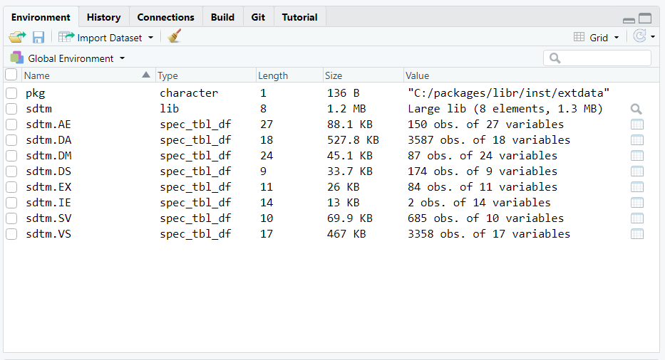

```{r, include = FALSE}
knitr::opts_chunk$set(
  collapse = TRUE,
  comment = "#>"
)
```
  
The **libr** package brings the concepts of data libraries, data 
dictionaries, and data steps to R.  

* A **data library** is an object used to define 
and manage an entire directory of data files.  
* A **data dictionary** is a data 
frame full of information about a data library, data frame, or tibble. 
* A **data step** is a mechanism to perform row-by-row processing of data.

These concepts have been available in SAS® software for decades. 
But they have not been available in R ... until now!

The **libr** package also includes an enhanced equality operator to
make data comparisons more intuitive.

### Key Functions

The above concepts are implemented in the **libr** package with four key 
functions. They are:

* `libname()`: Creates a data library
* `dictionary()`: Creates a data dictionary 
* `datastep()`: Performs row-by-row processing of data

### How to Use
Let's look at some simple examples of each of the four functions above.  These
examples will be using some sample data.  The sample data is included
in the **libr** package, and also available for download 
[here](https://github.com/dbosak01/libr/blob/master/inst/extdata/libr_data.zip).

#### The `libname()` Function
The **libr** `libname()` function is quite similar to the SAS® `libname`
statement.  The first parameter is the name of the library.  The 
second parameter is a path to a directory the library will point to.  The 
third parameter is the engine with which to read and write the data.  
```{r eval=FALSE, echo=TRUE} 
library(libr)

# Get path to sample data
pkg <- system.file("extdata", package = "libr")

# Define data library
libname(sdtm, pkg, "csv") 


```

The `libname()` function above will send two types of information to the console:

* The column specifications for each data file imported
* A summary print-out of the library 

The summary print-out looks like this:
```
# library 'sdtm': 8 items
- attributes: csv not loaded
- path: C:/packages/libr/inst/extdata
- items:
  Name Extension Rows Cols     Size        LastModified
1   AE       csv  150   27  88.1 Kb 2020-09-18 14:30:23
2   DA       csv 3587   18 527.8 Kb 2020-09-18 14:30:23
3   DM       csv   87   24  45.1 Kb 2020-09-18 14:30:23
4   DS       csv  174    9  33.7 Kb 2020-09-18 14:30:23
5   EX       csv   84   11    26 Kb 2020-09-18 14:30:23
6   IE       csv    2   14    13 Kb 2020-09-18 14:30:23
7   SV       csv  685   10  69.9 Kb 2020-09-18 14:30:24
8   VS       csv 3358   17   467 Kb 2020-09-18 14:30:24

```

The summary displays what type of library it is, where it is located,
and what data (if any) is already in the library directory.  In this case,
there are eight 'csv' files available.

For each of the eight files, the `libname()` function also displayed 
the column specifications used to import the data file.  A column 
specification looks like this:
```
$VS

-- Column specification ------------------------------------------
cols(
  STUDYID = col_character(),
  DOMAIN = col_character(),
  USUBJID = col_character(),
  VSSEQ = col_double(),
  VSTESTCD = col_character(),
  VSTEST = col_character(),
  VSPOS = col_character(),
  VSORRES = col_double(),
  VSORRESU = col_character(),
  VSSTRESC = col_double(),
  VSSTRESN = col_double(),
  VSSTRESU = col_character(),
  VSBLFL = col_character(),
  VISITNUM = col_double(),
  VISIT = col_character(),
  VSDTC = col_date(format = ""),
  VSDY = col_double()
)

```

The column specification shows how the data was imported.  Since 'csv'
files do not contain well-defined data type information on each of the columns,
the `libname` function has to guess at the data types.  The column
specification shows you what the guesses were.  This is useful information.
You should review these column specifications to see if the `libname` function
guessed correctly.  If it did not guess correctly, you can control 
the import data types by sending a `specs()` collection of `import_spec()`
objects to the `import_specs` parameter on the `libname()` function.  See
the `specs()` documentation for an example and additional details.

#### The `lib_load()` Function
Observe that there is difference between the SAS® `libname` statement and the 
**libr** `libname()` function.  The difference is that after the 
SAS® `libname` statement is called, the data is immediately available to
your code using two-level (\<library\>.\<dataset\>) syntax.  

With the **libr** function, on the other hand, the data is immediately 
available using list syntax on the library variable name.  To get the 
two-level syntax, you first have to call the `lib_load()` function.
```{r eval=FALSE, echo=TRUE} 

lib_load(sdtm)
# # library 'sdtm': 8 items
# - attributes: csv loaded
# - path: C:/packages/libr/inst/extdata
# - items:
#   Name Extension Rows Cols     Size        LastModified
# 1   AE       csv  150   27  88.1 Kb 2020-09-18 14:30:23
# 2   DA       csv 3587   18 527.8 Kb 2020-09-18 14:30:23
# 3   DM       csv   87   24  45.1 Kb 2020-09-18 14:30:23
# 4   DS       csv  174    9  33.7 Kb 2020-09-18 14:30:23
# 5   EX       csv   84   11    26 Kb 2020-09-18 14:30:23
# 6   IE       csv    2   14    13 Kb 2020-09-18 14:30:23
# 7   SV       csv  685   10  69.9 Kb 2020-09-18 14:30:24
# 8   VS       csv 3358   17   467 Kb 2020-09-18 14:30:24

```

Notice on the console printout that the library is now "loaded".  That means
the data has been loaded into the workspace, and is available using
two-level syntax. If you are working in **RStudio**, the environment 
pane will now show all the datasets available in the library.



At this point, you can work with your data very much the same way
as you would in SAS®.  You can pass these datasets into statistical functions, 
or manipulate them with **dplyr** functions. Note that you can also 
work with individual variables on the datasets using dollar sign ("$") syntax.  
```{r eval=FALSE, echo=TRUE} 
# Get total number of records
nrow(sdtm.DM)
# [1] 87

# Get frequency counts for each arm
table(sdtm.DM$ARM)
# ARM A          ARM B          ARM C          ARM D SCREEN FAILURE 
# 20             21             21             23              2 
```

The datasets will be available in the workspace for the length of your session.
If you wish to unload them from the workspace, call the `lib_unload()` 
function.  See the `lib_load()` and `lib_unload()` documentation for 
additional information on these functions.  

To see more examples of the **libr** data management 
functions, refer to the articles on [Basic Library Operations](libr-basics.html)
and [Library Management](libr-management.html).

#### The `dictionary()` Function
Once you have a library defined, you may want to examine 
the column attributes for the datasets in that library.
Examining those column attributes can be accomplished with the `dictionary()` 
function. The `dictionary()`
function returns a tibble of information about the data in the library.

Continuing from the example above, let's look at the dictionary for the 
'sdtm' library created previously.
```{r eval=FALSE, echo=TRUE}
dictionary(sdtm)
# # A tibble: 130 x 10
#    Name  Column  Class     Label Description Format Width Justify  Rows   NAs
#    <chr> <chr>   <chr>     <chr> <chr>       <lgl>  <int> <chr>   <int> <int>
#  1 AE    STUDYID character NA    NA          NA         3 NA        150     0
#  2 AE    DOMAIN  character NA    NA          NA         2 NA        150     0
#  3 AE    USUBJID character NA    NA          NA        10 NA        150     0
#  4 AE    AESEQ   numeric   NA    NA          NA        NA NA        150     0
#  5 AE    AETERM  character NA    NA          NA        72 NA        150     0
#  6 AE    AELLT   logical   NA    NA          NA        NA NA        150   150
#  7 AE    AELLTCD logical   NA    NA          NA        NA NA        150   150
#  8 AE    AEDECOD character NA    NA          NA        43 NA        150     0
#  9 AE    AEPTCD  numeric   NA    NA          NA        NA NA        150     0
# 10 AE    AEHLT   character NA    NA          NA        63 NA        150     0
# # ... with 120 more rows

```

The resulting dictionary table shows the name of the dataset, the column name, 
and some interesting attributes related to each column.  As you can see,
the **libr** dictionary table is overall quite similar to a SAS® dictionary
table.  See the `dictionary()` function documentation for more information.

### The `datastep()` Function
People with experience in SAS® software know that it is sometimes advantageous
to process row-by-row.  In SAS®, row-by-row processing done with a 
data step.  The data step is one of the most fundamental operations
when working in SAS®.

The **libr** package offers a `datastep()` function that simulates this style
of row-by-row processing.  The function includes several of the most basic
parameters available to the SAS® datastep: keep, drop, rename, retain, and by.
Here is a simple example, again using the data from the library already 
defined above:

```{r eval=FALSE, echo=TRUE}
age_groups <- datastep(sdtm.DM, 
                       keep = c("USUBJID", "AGE", "AGEG"), { 
                         
                         if (AGE >= 18 & AGE <= 29)
                           AGEG <- "18 to 29"
                         else if (AGE >= 30 & AGE <= 44)
                           AGEG <- "30 to 44"
                         else if (AGE >= 45 & AGE <= 59)
                           AGEG <- "45 to 59"
                         else 
                           AGEG <- "60+"
                         
                       })
age_groups
# # A tibble: 87 x 3
#    USUBJID      AGE AGEG    
#    <chr>      <dbl> <chr>   
#  1 ABC-01-049    39 30 to 44
#  2 ABC-01-050    47 45 to 59
#  3 ABC-01-051    34 30 to 44
#  4 ABC-01-052    45 45 to 59
#  5 ABC-01-053    26 18 to 29
#  6 ABC-01-054    44 30 to 44
#  7 ABC-01-055    47 45 to 59
#  8 ABC-01-056    31 30 to 44
#  9 ABC-01-113    74 60+     
# 10 ABC-01-114    72 60+     
# # ... with 77 more rows
```

Notice that the `datastep()` function kept only those variables specified
on the `keep` parameter.  The data step itself is passed within the 
curly braces. You can put any number of conditional statements and assignments
inside the curly braces, just like a SAS® data step. Also like a 
SAS® data step, you do not need to 'declare' new variables.  Any name 
not identified as an R function name is assumed to be a new variable,
and will be created automatically on the input data.

The datastep function also supports "first." and "last." functionality through
use of the `by` parameter.  See additional examples on the `datastep()`
help page and in the data step [article](libr-datastep.html).


### Next Steps 

For next steps, please review the examples provided in the vignette articles. 
Those articles include:

* [Basic Library Operations](libr-basics.html)
* [Library Management](libr-management.html)
* [Data Step Operations](libr-datastep.html)
* [Complete Example 1](libr-example1.html)
* [Complete Example 2](libr-example2.html)


